# 🎯 Adam Asmaca Oyunu

<div align="center">


**Java Swing ile geliştirilmiş, şifre korumalı Adam Asmaca masaüstü oyunu.**

🏆 Programlama Dilleri 2 — Dönem Ödevi

**Süleyman Demirel Üniversitesi | 2025-2026 Bahar Dönemi**

</div>

---

## 👨‍💻 Geliştirici

| Alan | Bilgi |
|------|-------|
| **Ad Soyad** | Berkan Kublay |
| **Bölüm** | Bilgisayar Mühendisliği |
| **Ders** | Programlama Dilleri 2 |
| **Dönem** | 2025-2026 Bahar |
| **Üniversite** | Süleyman Demirel Üniversitesi |

---

## 📖 Proje Hakkında

Bu proje, 2. sınıf 2. dönemde görülen **5 farklı dersin** konularından oluşan kelimelerle oynanan, **şifre korumalı** bir Adam Asmaca masaüstü oyunudur. Java Swing kütüphanesi kullanılarak NetBeans IDE ortamında geliştirilmiştir.

---

## 🖼️ Ekran Görüntüleri

### 🔐 Şifre Ekranı
> İlk açılışta şifre belirleme ekranı gelir. Kullanıcı şifresini iki kez girerek kaydeder.

<p align="center">
  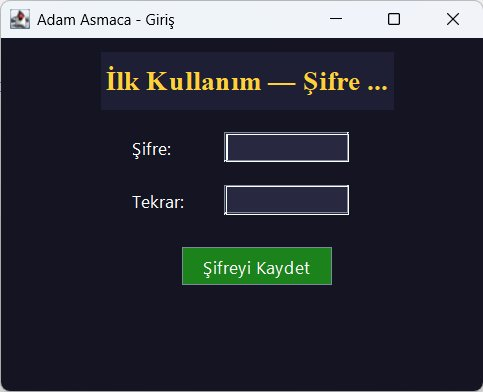
  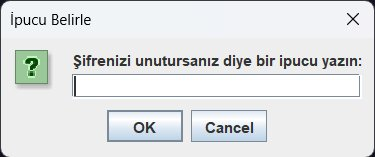
</p>
<p align="center">
  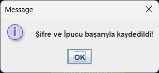
</p>

---

### 🎮 Oyun Ekranı
> Sol tarafta adam asmaca resmi, ortada harf kutucukları, sağda tahmin alanları. Süre sayacı ve yanlış sayacı anlık güncellenir.

<p align="center">
  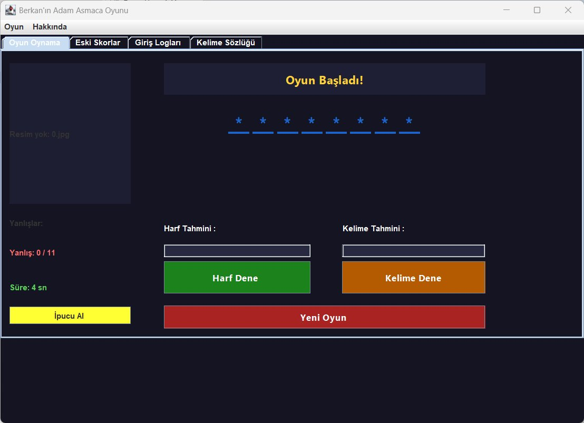
</p>

---

### 💡 İpucu Sistemi
> İpucu Al butonuna basıldığında onay penceresi açılır. Her kelime için yalnızca 1 ipucu hakkı vardır.

<p align="center">
  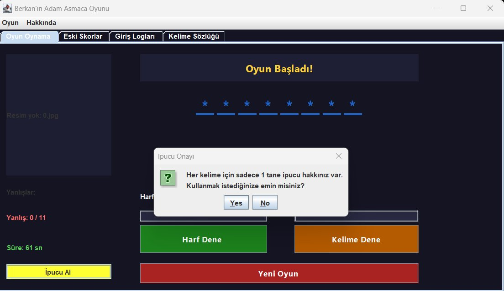
</p>

---

### ⚠️ Uyarı Mesajları
> Geçersiz karakter, Türkçe harf ve daha önce denenen harf girildiğinde uyarı gösterilir.

<p align="center">
  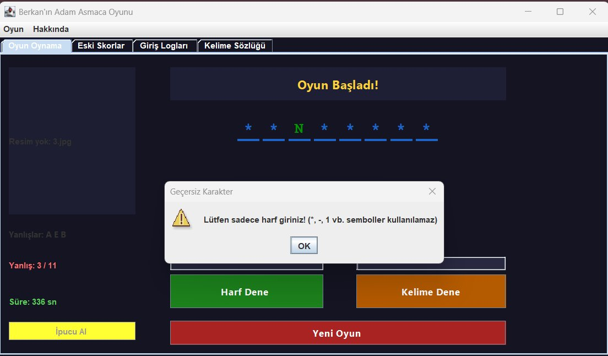
  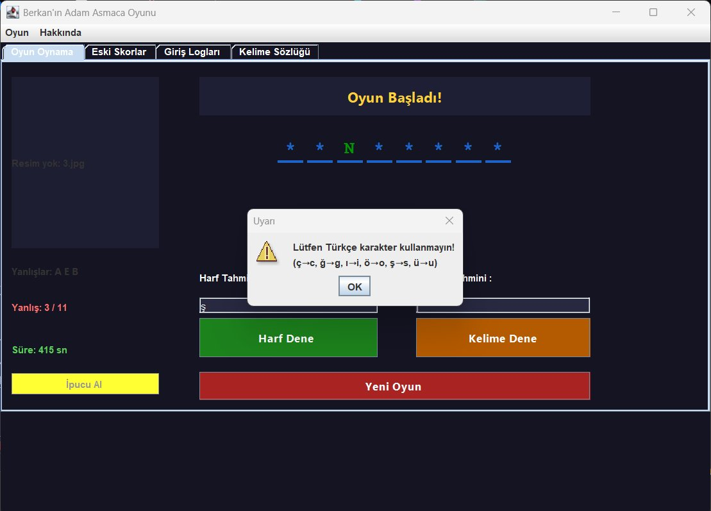
  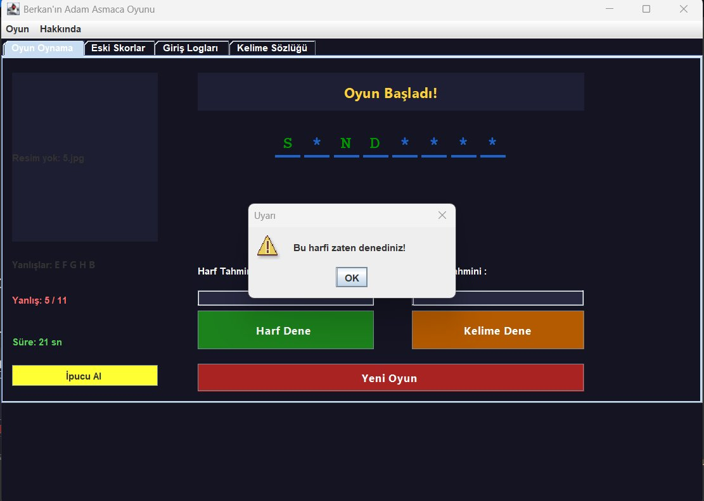
</p>

---

### 🏆 Oyun Sonuçları
> Kelime doğru tahmin edilince kazanılır, 11 yanlışta oyun biter ve doğru kelime gösterilir.

<p align="center">
  
  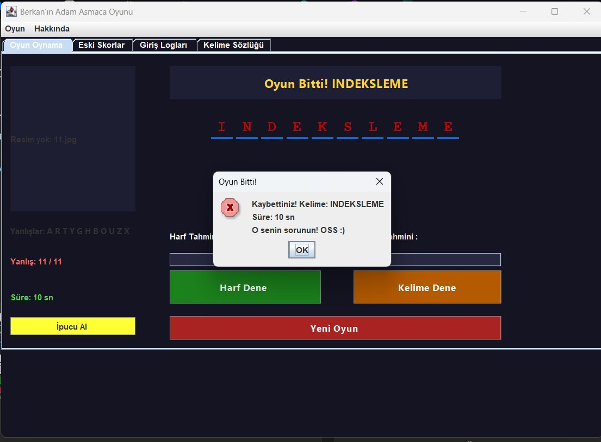
</p>

---

### 📖 Kelime Sözlüğü
> Oyunda çıkan her kelimenin dersi ve anlamı sözlükte listelenir.

<p align="center">
  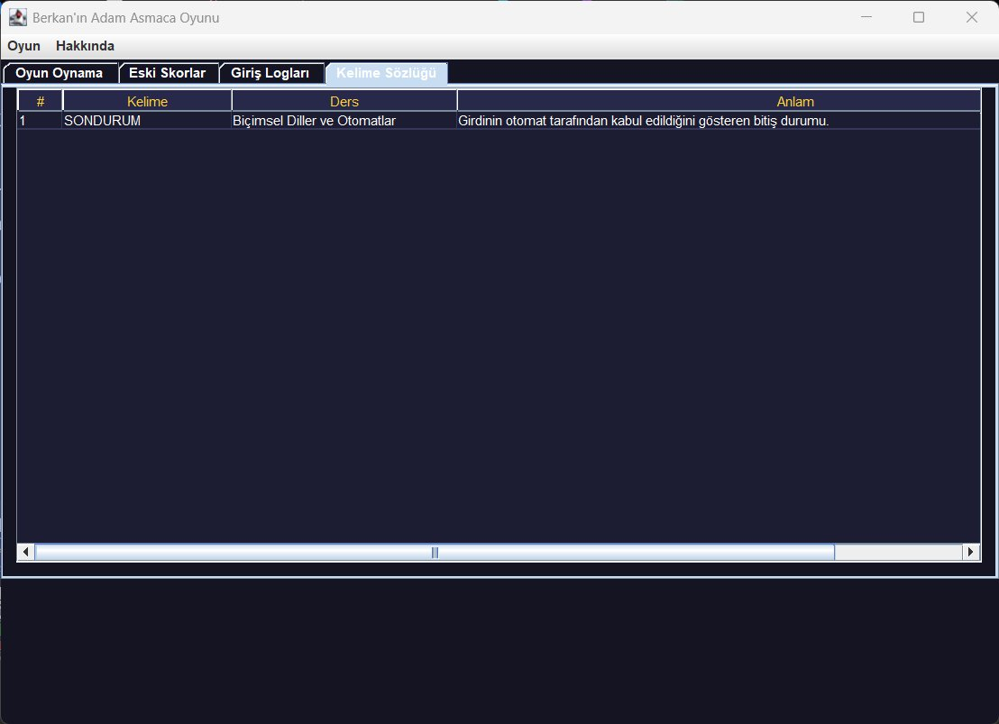
</p>

---

### 📊 Veri Yönetimi
> Eski skorlar ve giriş logları JTable ile listelenir, şifreli temizle butonu ile sıfırlanabilir.

<p align="center">
  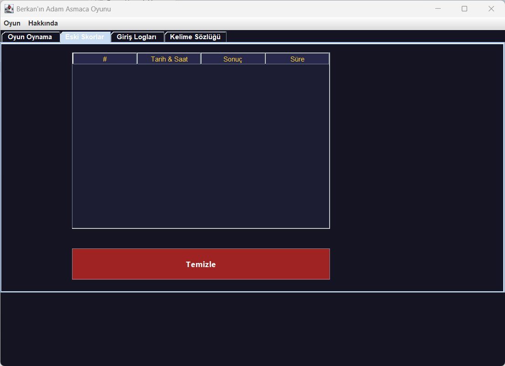
  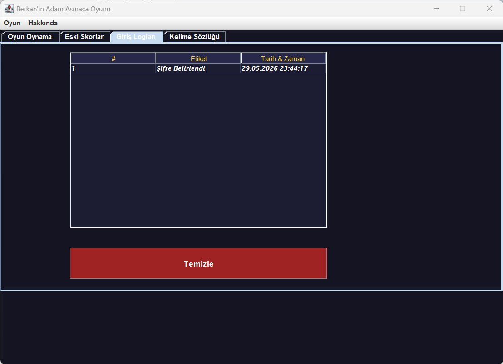
</p>

---

## ✨ Özellikler

### 🔐 Gelişmiş Şifre Sistemi
- İlk açılışta şifre belirleme ekranı gelir
- Şifre belirlerken **ipucu kaydetme** özelliği
- Yanlış girişlerde **şifre ipucunu gösterme**
- **3 hatalı girişte** program otomatik kapanır
- Her giriş denemesi tarih/saat ile `log.txt`'e kaydedilir

### 🎮 Oyun Özellikleri
- `kelimeler.txt`'ten **rastgele kelime** seçimi
- Harf sayısı kadar **dinamik JLabel** — başta `*` gösterir
- **Harf tahmini** — tek harf dene
- **Kelime tahmini** — doğrudan kelimeyi tahmin et
- **11 aşamalı** adam asmaca resmi
- Gerçek zamanlı **saniye sayacı**
- 💡 **İpucu Butonu** — her kelime için 1 hak, rastgele harf açar
- **Yanlış harfler gösterimi** — denenen yanlış harfler ekranda listelenir
- Türkçe karakter ve sembol girişi **engelleme**

### 📊 Veri Yönetimi
- Oyun sonuçları `oyunlar.txt`'e otomatik kaydedilir
- **Eski Skorlar** sekmesinde JTable ile listeleme
- **Giriş Logları** sekmesinde JTable ile listeleme
- Şifreli **Temizle** butonu ile tablolar sıfırlanabilir

### 📖 Kelime Sözlüğü (Ekstra Özellik)
- Oyunda çıkan kelimeler sözlüğe eklenir
- Her kelimenin **dersi** ve **anlamı** gösterilir
- Program kapanınca sözlük sıfırlanır, her oturumda taze başlar

---

## 🗂️ Dosya Yapısı

```
C:\P2Oyun\
├── 📁 Resimler\
│   ├── 0.jpg   ← Boş darağacı (başlangıç)
│   ├── 1.jpg
│   ├── ...
│   └── 11.jpg  ← Adam tamamen asılı (oyun bitti)
│
└── 📁 TXTDosyalar\
    ├── kelimeler.txt  ← 30 kelime (en az 6 harf)
    ├── sifre.txt      ← Otomatik oluşur
    ├── ipucu.txt      ← Otomatik oluşur
    ├── log.txt        ← Otomatik oluşur
    ├── oyunlar.txt    ← Otomatik oluşur
    └── gecmis.txt     ← Otomatik oluşur (sözlük için)
```

```
📁 AdamAsmaca (NetBeans Projesi)
└── 📁 src
    └── 📁 adamasmaca
        ├── Main.java           ← Programı başlatır
        ├── DosyaYonetici.java  ← Dosya işlemleri
        ├── SifreEkran.java     ← Şifre & giriş ekranı
        └── OyunEkran.java      ← Ana oyun ekranı
```

---

## ⚙️ Kurulum ve Çalıştırma

### Gereksinimler
- Java JDK 8 veya üzeri
- Apache NetBeans IDE

### Adımlar

**1.** `C:\P2Oyun\Resimler\` ve `C:\P2Oyun\TXTDosyalar\` klasörlerini oluşturun

**2.** `0.jpg` - `11.jpg` resimlerini `Resimler` klasörüne koyun

**3.** `kelimeler.txt` dosyasını `TXTDosyalar` klasörüne koyun

**4.** NetBeans'te projeyi açın → `Run Project (F6)`

> 💡 Diğer dosyalar ilk çalıştırmada **otomatik oluşur!**

---

## 🧩 Kelime Konuları

| Ders | Kelimeler |
|------|-----------|
| ⚡ Elektrik Devre Temelleri | DIRENCLER, KONDANSATOR, TRANSISTOR, GERILIM, KAPASITANS, OSILOSOP |
| 🔲 Lojik Devreler | MANTIKKAPISI, NANDKAPISI, NORKAPISI, XORKAPISI, KARNAUGH, KODLAYICI |
| ☕ Programlama Dilleri 2 | PROGRAMLAMA, KAPSULLEME, KALITIM, ARAYUZLER, SINIFLAR, NESNELER |
| 🗄️ Veri Tabanı | VERITABANI, NORMALFORM, TABLOSEMA, BIRINCILANAHTAR, YABANCILANAHTAR, INDEKSLEME |
| 🤖 Biçimsel Diller ve Otomatlar | DETERMINISTIK, OTOMAT, ALFABELER, GRAMERLER, SONDURUM, BASLANGIC |

---

## 🎨 Tasarım

| Renk | RGB | Kullanım |
|------|-----|----------|
| 🟡 Sarı | (255, 210, 60) | Başlık, durum metni |
| 🟢 Yeşil | (28, 130, 28) | Harf Dene butonu |
| 🟠 Turuncu | (180, 90, 0) | Kelime Dene butonu |
| 🔴 Kırmızı | (170, 35, 35) | Yeni Oyun & Temizle |
| 💛 Sarı | (255, 255, 51) | İpucu butonu |
| 🔵 Lacivert | (20, 20, 35) | Arka plan |

---

## 🛠️ Kullanılan Bileşenler

| Bileşen | Kullanım Yeri |
|---------|--------------|
| `JFrame` | Ana pencereler |
| `JTabbedPane` | 4 sekmeli oyun ekranı |
| `JMenuBar / JMenu / JMenuItem` | Oyun menüsü |
| `JLabel` (dinamik) | Harf kutuları |
| `JTextField` | Harf & kelime girişi |
| `JPasswordField` | Şifre girişi |
| `JButton` | Tüm butonlar |
| `JTable` | Skor ve log listeleme |
| `ImageIcon` | Adam asmaca resimleri |
| `javax.swing.Timer` | Saniye sayacı |
| `BufferedReader / BufferedWriter` | Dosya okuma/yazma |
| `LocalDateTime` | Tarih/saat bilgisi |

---

## 📝 Önemli Notlar

> ✅ Tüm dosya yolları `DosyaYonetici.java` sınıfında **sınıf değişkeni** olarak tanımlanmıştır

> ✅ Sadece `kelimeler.txt` değiştirilerek kelimeler güncellenebilir

> ✅ Kod içinde **hiçbir değişiklik** yapmaya gerek yoktur

> ✅ Türkçe karakter girişi kontrol edilir, kullanıcı uyarılır

---

<div align="center">

**İyi Oyunlar! 🎮**

</div>
